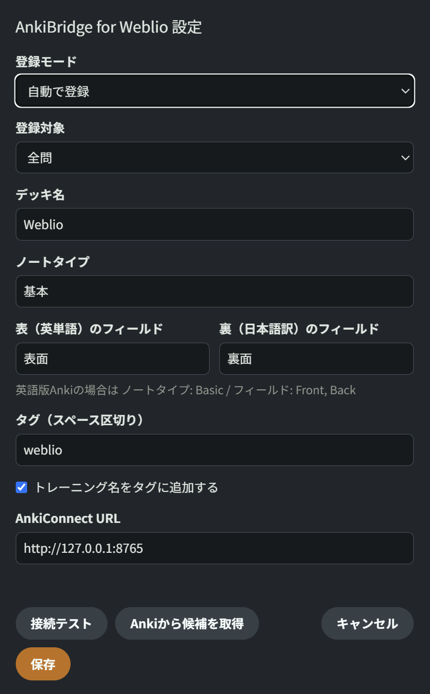

# AnkiBridge for Weblio

[Weblio Study](https://weblio-study.weblio.jp/) の単語トレーニングを解き終えると、結果画面の「出題リスト」から英単語と日本語訳を読み取り、Anki に自動で登録する Violentmonkey 用ユーザースクリプトです。

## 目次

- [必要なもの](#必要なもの)
- [インストール](#インストール)
- [使い方](#使い方)
- [設定](#設定)
- [トラブルシューティング](#トラブルシューティング)

## 必要なもの

- [Violentmonkey](https://violentmonkey.github.io/)（ブラウザ拡張）
- [Anki](https://apps.ankiweb.net/)（PC版）
- AnkiConnect アドオン（コード `2055492159`）

## インストール

### 1. AnkiConnect を入れる

Anki で **ツール → アドオン → アドオンを取得** を開き、`2055492159` を入力します。追加したら Anki を**再起動**してください。

### 2. スクリプトを入れる

Violentmonkey を入れた状態で、下のボタンを押してインストールします。

インストール画面が開いたら **確認してインストール** を押してください。更新は自動で行われます。

> [!NOTE]
> ボタンが動かない場合は、[Greasy Fork のページ](https://greasyfork.org/ja/scripts/599147-ankibridge-for-weblio) から **このスクリプトをインストール** を押してください。

### 3. 接続を確認する

1. Anki を起動したまま Weblio Study を開きます。
2. Violentmonkey のメニューから **設定を開く** を選びます。
3. **接続テスト** を押し、「接続OK」と出れば準備完了です。

> [!TIP]
> 英語版の Anki を使っている場合は、ここで設定も合わせておく（[設定](#設定) を参照）。

## 使い方

1. **Anki を起動しておきます。** AnkiConnect が動いていないと登録できません。
2. Weblio Study で単語トレーニングを最後まで解きます。
3. 結果画面が出ると、画面右下にパネルが表示され、単語が Anki に登録されます。

| 登録モード | 動き |
| --- | --- |
| 自動で登録（既定） | 結果画面が出た時点で登録します |
| ボタンを押して登録 | パネルの **Ankiに登録** を押したときだけ登録します |

- カードは **表 = 英単語、裏 = 日本語訳** で作られます。日本語から英語を選ぶ問題でも同じ向きです。
- 同じデッキに同じ英単語がすでにあれば登録せず、スキップした数を表示します。

## 設定

パネルの **⚙** ボタン、または Violentmonkey のメニュー **設定を開く** から変更できます。

  

| 項目 | 既定値 | 説明 |
| --- | --- | --- |
| 登録モード | 自動で登録 | 「ボタンを押して登録」に切り替えられます |
| 登録対象 | 全問 | 「間違えた単語のみ」「正解した単語のみ」も選べます |
| デッキ名 | `Weblio` | Anki にない場合は自動で作成されます |
| ノートタイプ | `基本` | 日本語版 Anki の標準ノートタイプです |
| 表 / 裏のフィールド | `表面` / `裏面` | ノートタイプのフィールド名です |
| タグ | `weblio` | スペース区切りで複数指定できます |
| トレーニング名をタグに追加 | ON | 例: `英検3級対策単語1` |
| AnkiConnect URL | `http://127.0.0.1:8765` | 通常は変更不要です |

> [!IMPORTANT]
> **英語版の Anki** を使っている場合は、次のように変更してください。
>
> - ノートタイプ: `Basic`
> - 表のフィールド: `Front`
> - 裏のフィールド: `Back`
>
> **Ankiから候補を取得** を押すと、Anki にあるデッキ・ノートタイプ・フィールド名が入力候補に出ます。

## トラブルシューティング

まず下の表で症状を探し、詳しい対処はリンク先を見てください。

| 症状 | よくある原因 |
| --- | --- |
| [「AnkiConnectに接続できません」と出る](#ankiconnectに接続できませんと出る) | Anki が起動していない / 通信が許可されていない |
| [「AnkiConnectへの接続がタイムアウトしました」と出る](#ankiconnectへの接続がタイムアウトしましたと出る) | Anki がダイアログ表示中などで応答できない |
| [「ノートタイプ『○○』がAnkiにありません」と出る](#ノートタイプがankiにありませんと出る) | 英語版 Anki などでノートタイプ名が違う |
| [「フィールド『○○』がありません」と出る](#フィールドがありませんと出る) | フィールド名が違う |
| [結果画面でパネルが出ない](#結果画面でパネルが出ない) | 単語トレーニング以外の結果画面 |
| [同じ結果をもう一度登録したい](#同じ結果をもう一度登録したい) | 自動モードでは一度登録した結果を再登録しない |
| [「登録対象（○○）の単語はありません」と出る](#登録対象の単語はありませんと出る) | 登録対象の絞り込みに当てはまる単語がない |

---

### 「AnkiConnectに接続できません」と出る

- [ ] Anki が起動しているか
- [ ] AnkiConnect アドオンが有効か（**ツール → アドオン** で確認）
- [ ] AnkiConnect を入れたあと Anki を再起動したか
- [ ] Violentmonkey の通信許可を拒否していないか

> [!NOTE]
> 初回はスクリプトから Anki への通信の許可を Violentmonkey に求められます。確認画面が出たら **許可** してください。

### 「AnkiConnectへの接続がタイムアウトしました」と出る

Anki が応答できない状態になっています。Anki で開いているダイアログ（同期中・アドオン画面など）を閉じてから、もう一度試してください。

### 「ノートタイプ『○○』がAnkiにありません」と出る

設定のノートタイプ名が Anki 側と一致していません。設定画面で **Ankiから候補を取得** を押し、候補から選び直してください。英語版 Anki なら `Basic` です。

### 「フィールド『○○』がありません」と出る

エラーメッセージの「あるのは: …」に、そのノートタイプで使えるフィールド名が表示されています。その名前を **表（英単語）のフィールド** / **裏（日本語訳）のフィールド** に入れてください。

### 結果画面でパネルが出ない

対象は **単語トレーニング** の結果画面（「Question n」「あなたの解答」「正解」が並ぶ画面）だけです。リスニングや会話などのトレーニングでは表示されません。

単語トレーニングなのに出ない場合は、ページを再読み込みするか、Violentmonkey でスクリプトが有効になっているか確認してください。

### 同じ結果をもう一度登録したい

自動モードでは、一度登録した結果を開き直しても「この結果は登録済みです」と表示され、再登録しません。もう一度登録するには、次のどちらかを使ってください（重複する単語はスキップされます）。

- Violentmonkey のメニューから **この結果をAnkiに登録** を選ぶ
- 設定で登録モードを **ボタンを押して登録** に切り替え、パネルの **Ankiに登録** を押す

> [!TIP]
> 自動登録が失敗したときは、パネルに **Ankiに登録** ボタンが出るので、原因を直したあとそのまま押して再試行できます。

### 「登録対象（○○）の単語はありません」と出る

設定の **登録対象** が「間違えた単語のみ」などになっていて、当てはまる単語がない状態です。全問正解したときなどに表示されます。

## ライセンス
Copyright 2026 Fuku856.

[MIT](LICENSE)
